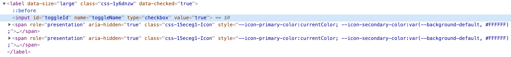

Capybara provides
[*find_field*](https://www.rubydoc.info/gems/capybara/Capybara%2FNode%2FFinders:find_field)
API to find input fields.

```
find_field('id_of_checkbox', type: 'checkbox')
```

To add assertions
for input fields
we can use
Rspec matcher
[*have_field*](https://www.rubydoc.info/gems/capybara/Capybara%2FRSpecMatchers:have_field)
which has similar usage as `find_field`.

```
expect(page).to have_field('id_of_checkbox', type: 'checkbox')
```

In some cases input fields are not
found using `find_field`,
specially when input field(s)
are added by third party library.

Let's take an example of
[toggle](https://atlassian.design/components/toggle/examples)
component that we recently used
to understand this problem better.

```
<Toggle
  id="toggleId"
  name="toggleName"
  size="large"
  isDisabled={disableToggle}
  value={toggleValue}
  isChecked={toggleValue}
  onChange={handleToggleChange}
/>
```

Adding above component
in react code generates
following HTML.



Let's try to
test our toggle(checkbox) element.

```
expect(page).to have_field('toggleId', type: 'checkbox', disabled: true)
```

This throws following error -

```
Failure/Error: expect(page).to have_field('toggleId', type: 'checkbox', disabled: true)
  expected to find visible field "toggleId" of type "checkbox" but there were no matches. Also found "", which matched the selector but not all filters.

```

This error is
because the
input was not
part of the
visible page.

To find such fields
we have to add
`visible` option
to `find_field`
or `have_field`
APIs.

```
find_field(
  'toggleId',
  type: 'checkbox',
  disabled: true,
  value: 'false',
  visible: false
)
```
or
```
expect(page).to have_field(
  'toggleId',
  type: 'checkbox',
  disabled: true,
  value: 'false',
  visible: false
)
```
